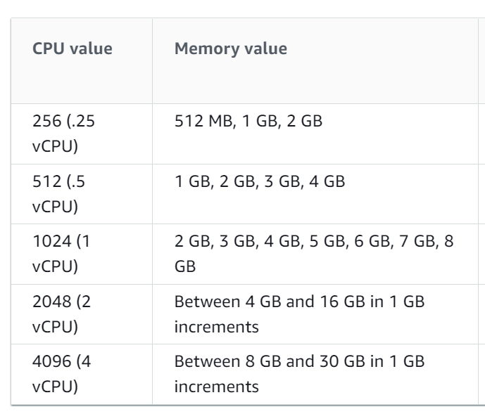

# dd-ecs


##Prerequisities

 - configured awscli
 - terraform >= 1.1
 - python3 with pip
 - docker


##Set-up
1. Rename locals_example.tf to locals.tf
2. Update locals with your settings
   1. CPU and Memory should be set according to :
      
   2. desired count means a number of containers running simultaniously
   3. you can add your public IP to whitelist, if required
3. Setup ECS environmment (VPC, subnets, ECR and so on)
```shell
    terraform init
    terraform apply
```
2. Install required python packages
```shell
    pip3 install -r requirements.txt
```
3. Build and deploy image
```shell
    python3 build.py
```